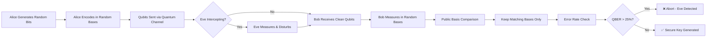

<div align="center">

# 🔐 BB84 Quantum Key Distribution Simulator


[](https://developer.mozilla.org/en-US/docs/Web/JavaScript)
[](https://qiskit.org/)
[](https://en.wikipedia.org/wiki/BB84)
[](LICENSE)

</div>

---

## 🌟 Overview

**BB84 Quantum Key Distribution** is an interactive web-based simulator that demonstrates how **quantum mechanics** enables **provably secure communication** between two parties. Named after its inventors **Bennett and Brassard (1984)**, this protocol uses the fundamental principles of quantum physics to detect eavesdropping attempts.

> *"Any observation of a quantum system disturbs its state"* - The core principle that makes BB84 unbreakable.

<div align="center">

### ⚛️ The Magic of Quantum Cryptography

</div>

Unlike classical encryption that relies on computational complexity, **BB84 uses physics itself** to guarantee security. If someone tries to intercept the quantum key, they inevitably disturb the quantum states, making their presence detectable.

---

## ✨ Key Features

<table>
<tr>
<td width="50%">

### 🎮 Interactive Simulation
- **Adjustable Qubit Count** with smooth slider controls
- **Real-time Protocol Execution** with visual feedback
- **Step-by-step visualization** of quantum states
- **Alice & Bob character representation**

</td>
<td width="50%">

### 🔬 Quantum Physics in Action
- **Random Basis Selection** (Z-basis & X-basis)
- **Quantum State Encoding** simulation
- **Measurement & Collapse** demonstration
- **Basis Reconciliation** process

</td>
</tr>
<tr>
<td width="50%">

### 👁️ Eavesdropper Detection
- **Toggle Eve mode** to simulate attacks
- **Automatic error rate calculation**
- **Visual indication** of compromised channels
- **Security threshold visualization**

</td>
<td width="50%">

### 📊 Results & Analytics
- **Secret Key Generation** display
- **Matching Basis Statistics**
- **QBER (Quantum Bit Error Rate)** computation
- **Interactive results table**

</td>
</tr>
</table>

---

## 🚀 How It Works

<div align="center">



</div>

### 🎯 Protocol Steps

1. **🎲 Random Generation**: Alice creates random bits (0s and 1s) and randomly chooses encoding bases (Z or X)
2. **📡 Quantum Transmission**: Each bit is encoded into a quantum state and sent to Bob
3. **🔍 Random Measurement**: Bob randomly selects measurement bases for each qubit
4. **📢 Basis Reconciliation**: Alice and Bob publicly compare which bases they used (NOT the bit values)
5. **🔑 Key Sifting**: They keep only bits where both used the same basis
6. **🛡️ Eavesdropping Check**: A subset is compared to calculate the error rate
7. **✅ Secure Key**: If error rate is below threshold (25%), the key is secure!

---

## 🎨 Visual Features

<div align="center">

### 🌈 Modern Animated UI

</div>

- **3D Card Effects** with smooth hover animations
- **Gradient Backgrounds** with dynamic color transitions
- **Particle Effects** for quantum state visualization
- **Smooth Transitions** for all interactive elements
- **Responsive Design** optimized for all screen sizes
- **Neon Glow Effects** for quantum-themed aesthetics
- **Interactive Tables** with color-coded results

---

## 💻 Tech Stack

<div align="center">


</div>

---

## 🎓 Educational Value

This simulator is perfect for:

- 📚 **Students** learning quantum cryptography fundamentals
- 🔬 **Researchers** demonstrating QKD concepts
- 👨‍🏫 **Educators** teaching quantum information theory
- 💼 **Portfolio Projects** showcasing quantum computing knowledge
- 🎯 **Cybersecurity Enthusiasts** exploring post-quantum cryptography

---

## 🔬 The Science Behind BB84

### Quantum States Used

| Bit Value | Z-Basis (Rectilinear) | X-Basis (Diagonal) |
|-----------|----------------------|-------------------|
| **0** | \|0⟩ (Horizontal) | \|+⟩ (Diagonal) |
| **1** | \|1⟩ (Vertical) | \|-⟩ (Anti-diagonal) |

### Why It's Secure

**Heisenberg Uncertainty Principle**: Measuring a quantum state in the wrong basis yields random results and disturbs the state.

**No-Cloning Theorem**: Unknown quantum states cannot be perfectly copied, preventing silent eavesdropping.

**Observable Disturbance**: Any measurement by Eve introduces detectable errors in Bob's results.

---

## 🛠️ Installation & Usage

### Quick Start

```bash
# Clone the repository
git clone https://github.com/PRODHOSH/qkd_simulation

# Navigate to project directory
cd qkd_simulation

# Open in browser
open index.html
```

### Live Demo

🌐 **[Try it Live on Lovable](your-lovable-link-here)**

### Usage Instructions

1. **Set Qubit Count**: Use the slider to choose how many qubits to simulate (default: 8)
2. **Toggle Eve**: Check the box to include an eavesdropper in the simulation
3. **Run Simulation**: Click the "Run BB84 Simulation" button
4. **View Results**: Examine the:
   - Qubit-by-qubit breakdown table
   - Final secret key generated
   - Error rate statistics
   - Matching basis count

---

## 📊 Example Output

```
🔐 BB84 Simulation Results
━━━━━━━━━━━━━━━━━━━━━━━━━━━━━━━━━━━━━

📡 Total Qubits Transmitted: 8
✅ Matching Bases: 4
🔑 Secret Key Length: 4 bits

🔐 Final Secret Key: 1011

📈 Statistics:
   • QBER (Quantum Bit Error Rate): 0.00%
   • Security Status: ✅ SECURE
   • Eve Detected: No
```

---

## 🌟 Project Highlights

<div align="center">

### 🏆 What Makes This Special

</div>

✅ **First Principles Implementation** - Built from quantum mechanics fundamentals  
✅ **Educational Focus** - Clear explanations and visual feedback  
✅ **Interactive Learning** - Hands-on experience with quantum protocols  
✅ **Production Quality** - Professional UI/UX design  
✅ **Open Source** - Free for educational and research use  

---

## 🔮 Future Enhancements

- [ ] **Bloch Sphere Visualization** for quantum state representation
- [ ] **E91 Protocol** implementation (entanglement-based QKD)
- [ ] **Noise Simulation** for realistic quantum channel modeling
- [ ] **Backend Integration** for storing simulation results
- [ ] **Multi-language Support** for international accessibility
- [ ] **Advanced Analytics** dashboard with statistical analysis
- [ ] **Mobile App** version for on-the-go learning

---

## 📚 Resources & References

### Learn More About BB84

- 📖 [Original BB84 Paper (1984)](https://arxiv.org/abs/2003.06557)
- 🎓 [Quantum Key Distribution - Wikipedia](https://en.wikipedia.org/wiki/Quantum_key_distribution)
- 🔬 [IBM Quantum Experience](https://quantum-computing.ibm.com/)
- 📺 [BB84 Explained - YouTube](https://www.youtube.com/results?search_query=bb84+protocol)

### Quantum Computing Tools

- ⚛️ [Qiskit](https://qiskit.org/) - IBM's Quantum Computing Framework
- 🔵 [Cirq](https://quantumai.google/cirq) - Google's Quantum Programming Framework
- 🌊 [Amazon Braket](https://aws.amazon.com/braket/) - AWS Quantum Computing Service

---

## 🤝 Contributing

Contributions are welcome! Feel free to:

- 🐛 Report bugs
- 💡 Suggest new features
- 🔧 Submit pull requests
- 📖 Improve documentation

---

## 📄 License

This project is licensed under the **MIT License** - see the [LICENSE](LICENSE) file for details.

---

## 👨‍💻 Author

**Your Name**

[](https://github.com/PRODHOSH)
[](https://linkedin.com/in/prodhoshvs)
[](https://prodhosh.github.io/portfolio/)

---

<div align="center">

### 🌟 If you found this project helpful, please give it a ⭐ star!

Made with ❤️ and Quantum Physics


</div>
