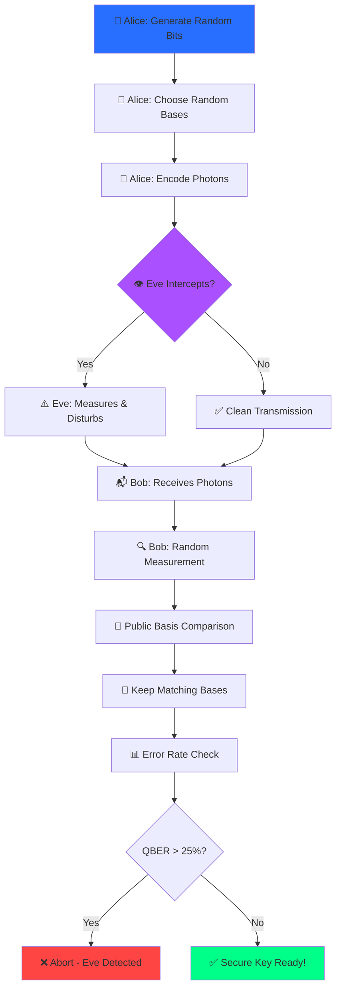
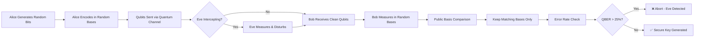

<div align="center">


<br/>

[](https://reactjs.org/)
[](https://www.typescriptlang.org/)
[](https://threejs.org/)
[](https://vitejs.dev/)
[](https://tailwindcss.com/)

[](https://prodhosh.github.io/bb84_simulation/)
[](https://github.com/PRODHOSH/bb84_simulation/stargazers)
[](LICENSE)

</div>

---

## � Overview

> **Experience quantum cryptography like never before** - Watch individual photons travel through space in real-time 3D as they establish an unbreakable secret key!

**BB84 Quantum Key Distribution Simulator** is a cutting-edge web application that brings quantum mechanics to life. Built with **React**, **Three.js**, and modern web technologies, it provides an immersive 3D visualization of the groundbreaking BB84 protocol invented by **Charles Bennett** and **Gilles Brassard** in 1984.

### 🎯 The Quantum Advantage

Traditional encryption can be broken with enough computing power. **Quantum Key Distribution** uses the laws of physics themselves to guarantee security - making it **future-proof against even quantum computers**!

<div align="center">

```
┌─────────────────────────────────────────────────────────────┐
│  "Any observation of a quantum system disturbs its state"   │
│        - The principle that makes BB84 unbreakable          │
└─────────────────────────────────────────────────────────────┘
```

</div>

---

## ✨ Features

<table>
<tr>
<td width="50%">

### 🎮 Interactive 3D Simulation
- **Real-time photon animation** in 3D space
- **Adjustable photon count** (8-32)
- **Color-coded basis matching**
  - 🟢 Green = Bases match (key kept)
  - 🔴 Red = Bases differ (discarded)
- **Smooth camera controls** and zoom
- **Particle effects** for quantum states

</td>
<td width="50%">

### 🔬 Quantum Physics Visualization
- **4 Polarization States** fully rendered:
  - Vertical (|) - Horizontal (—)
  - Diagonal (/) - Anti-diagonal (\)
- **Rectilinear (+) & Diagonal (×)** bases
- **Photon state collapse** on measurement
- **Quantum uncertainty** demonstrated

</td>
</tr>
<tr>
<td width="50%">

### 👁️ Eavesdropper Simulation
- **Toggle Eve mode** with one click
- **Real-time error injection**
- **QBER calculation** (Quantum Bit Error Rate)
- **Security threshold** visualization
- **Automatic detection** of tampering

</td>
<td width="50%">

### 📊 Advanced Analytics
- **Interactive dashboard** with charts
- **Key generation statistics**
- **Efficiency metrics**
- **Error rate analysis**
- **Basis matching breakdown**
- **Export simulation results**

</td>
</tr>
</table>

---

## 🎨 Stunning UI/UX

<div align="center">

### 💎 Modern Design Features

</div>

- 🌟 **Animated starfield** background with colorful particles
- 🎨 **Quantum gradient** color scheme (Blue → Purple)
- ✨ **Glow effects** on interactive elements
- 🎭 **Smooth transitions** and animations
- 📱 **Fully responsive** design for all devices
- 🌙 **Dark theme** optimized for long viewing
- 🎯 **Intuitive controls** with tooltips
- 💬 **Built-in AI chatbot** for instant help

---

## 🚀 Quick Start

### Prerequisites

```bash
Node.js 18+ and npm/yarn/bun
```

### Installation

```bash
# Clone the repository
git clone https://github.com/PRODHOSH/bb84_simulation.git

# Navigate to project
cd bb84_simulation

# Install dependencies
npm install
# or
yarn install
# or
bun install

# Start development server
npm run dev
# or
yarn dev
# or
bun dev
```

### Build for Production

```bash
npm run build
npm run preview
```

---

## 🎯 How to Use

<div align="center">

### 🎬 Step-by-Step Guide

</div>

1. **⚙️ Set Parameters**
   - Adjust photon count using the slider (8-32)
   - Toggle Eve to simulate eavesdropping

2. **▶️ Run Simulation**
   - Click "Run Simulation" button
   - Watch photons travel in 3D space

3. **👀 Observe**
   - Green photons = Matching bases (kept)
   - Red photons = Different bases (discarded)
   - See polarization states in real-time

4. **📊 Analyze Results**
   - View secret key generated
   - Check error rates
   - Explore analytics dashboard

---

## 🔬 The Science

### Protocol Steps



### Quantum States

| Basis | State | Symbol | Bit Value |
|-------|-------|--------|-----------|
| **Rectilinear (+)** | Vertical | \| | 0 |
| **Rectilinear (+)** | Horizontal | — | 1 |
| **Diagonal (×)** | Diagonal | / | 0 |
| **Diagonal (×)** | Anti-diagonal | \ | 1 |

### Security Guarantee

**No-Cloning Theorem** + **Heisenberg Uncertainty** = **Unbreakable Security** ✨

---

## 💻 Tech Stack

<div align="center">

### 🛠️ Built With Modern Tools


</div>

**Frontend Framework**: React 18 with TypeScript  
**3D Graphics**: Three.js + React Three Fiber  
**Build Tool**: Vite 5  
**Styling**: Tailwind CSS + Shadcn/ui components  
**State Management**: React Context API  
**Animations**: Framer Motion  
**Routing**: React Router v6  

---

## 📚 Educational Value

Perfect for:

- 🎓 **Students** learning quantum cryptography
- 👨‍🏫 **Educators** teaching quantum mechanics
- 🔬 **Researchers** demonstrating QKD concepts  
- 💼 **Professionals** exploring post-quantum security
- 🌟 **Enthusiasts** fascinated by quantum physics

### Learning Resources

- [📖 Original BB84 Paper](https://arxiv.org/abs/2003.06557)
- [🎓 Wikipedia: Quantum Key Distribution](https://en.wikipedia.org/wiki/Quantum_key_distribution)
- [⚛️ IBM Quantum Computing](https://quantum-computing.ibm.com/)
- [🔵 Google Quantum AI](https://quantumai.google/)

---

## 🎯 Project Structure

```
bb84_simulation/
├── src/
│   ├── components/
│   │   ├── simulation/
│   │   │   ├── PhotonScene.tsx       # 3D visualization
│   │   │   ├── PhotonParticle.tsx    # Individual photon
│   │   │   ├── KeyResults.tsx        # Results display
│   │   │   └── AnalyticsDashboard.tsx
│   │   └── ui/                       # Reusable UI components
│   ├── contexts/
│   │   └── SimulationContext.tsx     # State management
│   ├── hooks/
│   │   └── useBB84Simulation.ts      # Core BB84 logic
│   ├── pages/
│   │   ├── Home.tsx
│   │   ├── Theory.tsx
│   │   ├── Simulation.tsx
│   │   └── NotFound.tsx
│   └── lib/
│       └── utils.ts
├── public/
│   ├── team.html                     # Team page
│   └── images/
└── ...config files
```

---

## 👥 Meet the Team

<div align="center">

**VIT University Engineering Physics Project**

🔧 **Joshwa** - Hardware Engineer  
💻 **Prodhosh** - Full-Stack Developer  
📄 **Raghav** - Documentation Lead  
📊 **Sachin** - Presentation Specialist  
📊 **Sudhir** - Presentation Specialist  
📄 **Vijay Nishal** - Documentation Lead

[**→ View Full Team**](https://prodhosh.github.io/bb84_simulation/team.html)

</div>

---

## 🌟 Highlights

<div align="center">

### 🏆 What Makes This Special

✅ **Industry-Grade Code** - Production-ready React/TypeScript  
✅ **Real Physics** - Accurate quantum mechanics simulation  
✅ **3D Graphics** - Smooth 60fps rendering with Three.js  
✅ **Interactive Learning** - Hands-on quantum education  
✅ **Modern Stack** - Latest web technologies  
✅ **Open Source** - Free for educational use  
✅ **AI Chatbot** - Instant help and explanations  
✅ **Responsive Design** - Works on all devices  

</div>

---

## 🔮 Roadmap

- [ ] **VR Support** for immersive quantum experience
- [ ] **E91 Protocol** (entanglement-based QKD)
- [ ] **Bloch Sphere** visualization
- [ ] **Noise Models** for realistic channels
- [ ] **Performance Metrics** comparison
- [ ] **Multi-language** support
- [ ] **Tutorial Mode** with guided tours
- [ ] **Advanced Analytics** with ML predictions

---

## 🤝 Contributing

Contributions make the open-source community amazing! Any contributions are **greatly appreciated**.

1. Fork the Project
2. Create your Feature Branch (`git checkout -b feature/AmazingFeature`)
3. Commit your Changes (`git commit -m 'Add some AmazingFeature'`)
4. Push to the Branch (`git push origin feature/AmazingFeature`)
5. Open a Pull Request

---

## 📄 License

Distributed under the **MIT License**. See `LICENSE` for more information.

---

## 🔗 Links

<div align="center">

[](https://prodhosh.github.io/bb84_simulation/)
[](https://github.com/PRODHOSH/bb84_simulation)
[](https://prodhosh.github.io/prodhosh-portfolio/)

</div>

---

## 💬 Connect

<div align="center">

**Prodhosh VS**

[](https://github.com/PRODHOSH)
[](https://linkedin.com/in/prodhoshvs)
[](https://prodhosh.github.io/prodhosh-portfolio/)
[](https://instagram.com/itzprodhosh)

</div>

---

<div align="center">

### ⭐ If this project helped you, please give it a star!

**Made with ❤️ and Quantum Physics**


</div>

---

## ✨ Key Features

<table>
<tr>
<td width="50%">

### 🎮 Interactive Simulation
- **Adjustable Qubit Count** with smooth slider controls
- **Real-time Protocol Execution** with visual feedback
- **Step-by-step visualization** of quantum states
- **Alice & Bob character representation**

</td>
<td width="50%">

### 🔬 Quantum Physics in Action
- **Random Basis Selection** (Z-basis & X-basis)
- **Quantum State Encoding** simulation
- **Measurement & Collapse** demonstration
- **Basis Reconciliation** process

</td>
</tr>
<tr>
<td width="50%">

### 👁️ Eavesdropper Detection
- **Toggle Eve mode** to simulate attacks
- **Automatic error rate calculation**
- **Visual indication** of compromised channels
- **Security threshold visualization**

</td>
<td width="50%">

### 📊 Results & Analytics
- **Secret Key Generation** display
- **Matching Basis Statistics**
- **QBER (Quantum Bit Error Rate)** computation
- **Interactive results table**

</td>
</tr>
</table>

---

## 🚀 How It Works

<div align="center">



</div>

### 🎯 Protocol Steps

1. **🎲 Random Generation**: Alice creates random bits (0s and 1s) and randomly chooses encoding bases (Z or X)
2. **📡 Quantum Transmission**: Each bit is encoded into a quantum state and sent to Bob
3. **🔍 Random Measurement**: Bob randomly selects measurement bases for each qubit
4. **📢 Basis Reconciliation**: Alice and Bob publicly compare which bases they used (NOT the bit values)
5. **🔑 Key Sifting**: They keep only bits where both used the same basis
6. **🛡️ Eavesdropping Check**: A subset is compared to calculate the error rate
7. **✅ Secure Key**: If error rate is below threshold (25%), the key is secure!

---

## 🎨 Visual Features

<div align="center">

### 🌈 Modern Animated UI

</div>

- **3D Card Effects** with smooth hover animations
- **Gradient Backgrounds** with dynamic color transitions
- **Particle Effects** for quantum state visualization
- **Smooth Transitions** for all interactive elements
- **Responsive Design** optimized for all screen sizes
- **Neon Glow Effects** for quantum-themed aesthetics
- **Interactive Tables** with color-coded results

---

## 💻 Tech Stack

<div align="center">


</div>

---

## 🎓 Educational Value

This simulator is perfect for:

- 📚 **Students** learning quantum cryptography fundamentals
- 🔬 **Researchers** demonstrating QKD concepts
- 👨‍🏫 **Educators** teaching quantum information theory
- 💼 **Portfolio Projects** showcasing quantum computing knowledge
- 🎯 **Cybersecurity Enthusiasts** exploring post-quantum cryptography

---

## 🔬 The Science Behind BB84

### Quantum States Used

| Bit Value | Z-Basis (Rectilinear) | X-Basis (Diagonal) |
|-----------|----------------------|-------------------|
| **0** | \|0⟩ (Horizontal) | \|+⟩ (Diagonal) |
| **1** | \|1⟩ (Vertical) | \|-⟩ (Anti-diagonal) |

### Why It's Secure

**Heisenberg Uncertainty Principle**: Measuring a quantum state in the wrong basis yields random results and disturbs the state.

**No-Cloning Theorem**: Unknown quantum states cannot be perfectly copied, preventing silent eavesdropping.

**Observable Disturbance**: Any measurement by Eve introduces detectable errors in Bob's results.

---

## 🛠️ Installation & Usage

### Quick Start

```bash
# Clone the repository
git clone https://github.com/PRODHOSH/qkd_simulation

# Navigate to project directory
cd qkd_simulation

# Open in browser
open index.html
```

### Live Demo

🌐 **[Check it out !](https://prodhosh.github.io/qkd_simulation/)**

### Usage Instructions

1. **Set Qubit Count**: Use the slider to choose how many qubits to simulate (default: 8)
2. **Toggle Eve**: Check the box to include an eavesdropper in the simulation
3. **Run Simulation**: Click the "Run BB84 Simulation" button
4. **View Results**: Examine the:
   - Qubit-by-qubit breakdown table
   - Final secret key generated
   - Error rate statistics
   - Matching basis count

---

## 📊 Example Output

```
🔐 BB84 Simulation Results
━━━━━━━━━━━━━━━━━━━━━━━━━━━━━━━━━━━━━

📡 Total Qubits Transmitted: 8
✅ Matching Bases: 4
🔑 Secret Key Length: 4 bits

🔐 Final Secret Key: 1011

📈 Statistics:
   • QBER (Quantum Bit Error Rate): 0.00%
   • Security Status: ✅ SECURE
   • Eve Detected: No
```

---

## 🌟 Project Highlights

<div align="center">

### 🏆 What Makes This Special

</div>

✅ **First Principles Implementation** - Built from quantum mechanics fundamentals  
✅ **Educational Focus** - Clear explanations and visual feedback  
✅ **Interactive Learning** - Hands-on experience with quantum protocols  
✅ **Production Quality** - Professional UI/UX design  
✅ **Open Source** - Free for educational and research use  

---

## 🔮 Future Enhancements

- [ ] **Bloch Sphere Visualization** for quantum state representation
- [ ] **E91 Protocol** implementation (entanglement-based QKD)
- [ ] **Noise Simulation** for realistic quantum channel modeling
- [ ] **Backend Integration** for storing simulation results
- [ ] **Multi-language Support** for international accessibility
- [ ] **Advanced Analytics** dashboard with statistical analysis
- [ ] **Mobile App** version for on-the-go learning

---

## 📚 Resources & References

### Learn More About BB84

- 📖 [Original BB84 Paper (1984)](https://arxiv.org/abs/2003.06557)
- 🎓 [Quantum Key Distribution - Wikipedia](https://en.wikipedia.org/wiki/Quantum_key_distribution)
- 🔬 [IBM Quantum Experience](https://quantum-computing.ibm.com/)
- 📺 [BB84 Explained - YouTube](https://www.youtube.com/results?search_query=bb84+protocol)

### Quantum Computing Tools

- ⚛️ [Qiskit](https://qiskit.org/) - IBM's Quantum Computing Framework
- 🔵 [Cirq](https://quantumai.google/cirq) - Google's Quantum Programming Framework
- 🌊 [Amazon Braket](https://aws.amazon.com/braket/) - AWS Quantum Computing Service

---

## 🤝 Contributing

Contributions are welcome! Feel free to:

- 🐛 Report bugs
- 💡 Suggest new features
- 🔧 Submit pull requests
- 📖 Improve documentation

---

## 📄 License

This project is licensed under the **MIT License** - see the [LICENSE](LICENSE) file for details.

---

## 👨‍💻 Author

**Your Name**

[](https://github.com/PRODHOSH)
[](https://linkedin.com/in/prodhoshvs)
[](https://prodhosh.github.io/portfolio/)

---

<div align="center">

### 🌟 If you found this project helpful, please give it a ⭐ star!

Made with ❤️ and Quantum Physics


</div>
